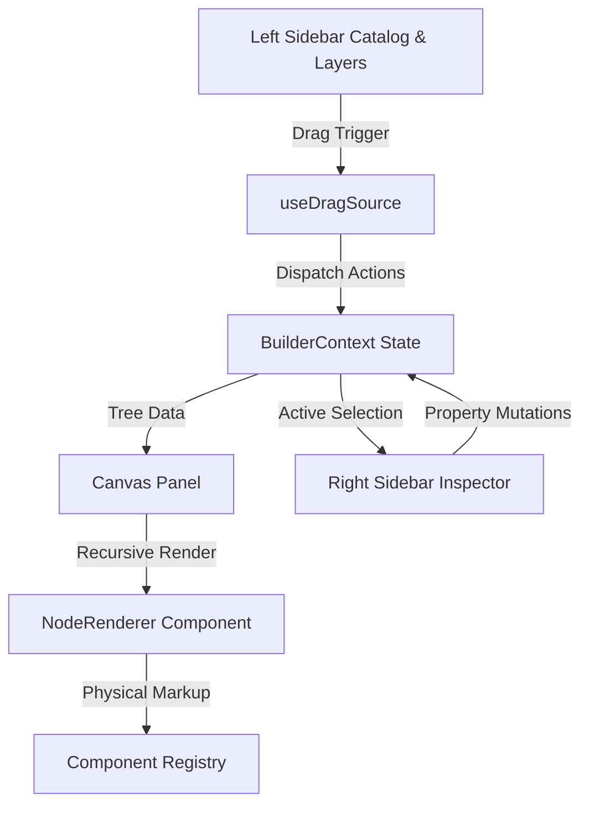

# Frontend Guru — Architecture & Directory Map

Welcome to the **Frontend Guru** architecture and directory map. This document provides a high-level conceptual overview and a detailed file-by-file blueprint of the low-code, drag-and-drop React visual builder system.

---

## 🏗️ High-Level Conceptual Architecture

Frontend Guru is a frontend builder engine designed around a **single-direction unified tree state flow**:
1. **State Engine (`src/store/`)**: Maintains a hierarchical component tree representing the visual page layout, along with select status, preview modes, and history stacks (undo/redo).
2. **Left Sidebar (`src/components/sidebar-left/`)**: Houses the dynamically cataloged component library and recursive layers trees.
3. **Canvas Columns (`src/components/canvas/`)**: Renders the active viewport, captures drag-and-drop events, and dynamically iterates the layout tree.
4. **Right Sidebar (`src/components/sidebar-right/`)**: Inspects the properties, padding, custom parameters, slots, and layer controls of the currently selected element.
5. **Component Registry (`src/registry/`)**: Acts as the physical translation layer, providing metadata schemas (inputs, options, default sizes) and the actual React markup for elements (e.g., HeroBanner, FlexRow).

---

## 📂 Complete Directory & File-by-File Blueprint

Below is the exhaustive file structure mapping under the `src/` directory, detailing the role and responsibility of each resource.

### 📁 `src/` (Application Core Root)
*   **[App.jsx](file:///c:/projects/frontend-guru/src/App.jsx)**: The root wrapper component. Orchestrates the 3-column app shell layout (`.app-shell`), manages page-swapping, active preview modes, and exit buttons.
*   **[App.css](file:///c:/projects/frontend-guru/src/App.css)**: Top-level transitions and animations setup for page-swapping, toast alerts, and layout grids.
*   **[main.jsx](file:///c:/projects/frontend-guru/src/main.jsx)**: Application entrypoint. Boots the React context, mounts the React Virtual DOM, and registers all CSS files under the correct cascading precedence hierarchy.
*   **[index.css](file:///c:/projects/frontend-guru/src/index.css)**: System design system tokens. Declares design variables (HSL color system, shadows, spacing, type sizes, and standard dark/light mode configurations).

---

### 📁 `src/components/` (Interface Views)
Houses modularized panels that make up the builder shell.

#### 🔲 `src/components/canvas/` (Workspace & Renderers)
*   **[Canvas.jsx](file:///c:/projects/frontend-guru/src/components/canvas/Canvas.jsx)**: The active workspace. Simulates physical viewports (Desktop, Tablet, Mobile), and tracks continuous height resizers.
*   **[CanvasPanel.jsx](file:///c:/projects/frontend-guru/src/components/canvas/CanvasPanel.jsx)**: The workspace header toolbar. Contains page selection tabs, viewport dimensions modifiers, clear-canvas action buttons, and preview modes triggers.
*   **[NodeRenderer.jsx](file:///c:/projects/frontend-guru/src/components/canvas/NodeRenderer.jsx)**: The recursive rendering engine. Maps component definition markups, overlays selections, controls, and snaps nodes inside layout slots.

#### 👈 `src/components/sidebar-left/` (Library Catalog & Layer Tree)
*   **[ComponentSidebar.jsx](file:///c:/projects/frontend-guru/src/components/sidebar-left/ComponentSidebar.jsx)**: Leftmost drawer. Manages dual tabs (data-driven component library and recursive layer trees) and inlines the lightweight ComponentTile helper.
*   **[LayersPanel.jsx](file:///c:/projects/frontend-guru/src/components/sidebar-left/LayersPanel.jsx)**: Recursive tree representation of the active layout tree. Shows nesting structures, visual toggles, and handles HTML5 drag sibling reordering.

#### 👉 `src/components/sidebar-right/` (Property Customizers)
*   **[InspectorPanel.jsx](file:///c:/projects/frontend-guru/src/components/sidebar-right/InspectorPanel.jsx)**: The properties control deck. Extracts schema parameters from the selected node, rendering modular LayeringControls and SlotPositioner components.
*   **[PropertyControls.jsx](file:///c:/projects/frontend-guru/src/components/sidebar-right/PropertyControls.jsx)**: Consolidated form fields. Houses all lightweight atomic inputs (TextField, NumberField, SelectField, ColorField, ToggleField, TextareaWidget) under a single module.
*   **[LayoutRebalancer.jsx](file:///c:/projects/frontend-guru/src/components/sidebar-right/LayoutRebalancer.jsx)**: A layout rebalancing controller. Houses custom range sliders allowing developers to shift row heights or column grid percentages interactively.
*   **[PageSettingsInspector.jsx](file:///c:/projects/frontend-guru/src/components/sidebar-right/PageSettingsInspector.jsx)**: Global page controller. Displays when no element is selected, allowing global editing of document background colors, base heights, and padding.
*   **[SlotInspector.jsx](file:///c:/projects/frontend-guru/src/components/sidebar-right/SlotInspector.jsx)**: Sub-inspector displaying slot specifications (drop padding, column-based grids, specific border parameters, and snapping locks).

---

### 📁 `src/hooks/` (Behavioral Middleware)
Decouples geometric/collision calculations and event-binding side effects from pure presentational renderers.

*   **[useDragSource.js](file:///c:/projects/frontend-guru/src/hooks/useDragSource.js)**: Configures sidebar drag-start handlers. Generates dynamic transfer packets containing target component types.
*   **[useCanvasResizer.js](file:///c:/projects/frontend-guru/src/hooks/useCanvasResizer.js)**: Manages mouse-drag resizing of the canvas frame container, with velocity-based viewport scrolling calculations.
*   **[useCanvasDrop.js](file:///c:/projects/frontend-guru/src/hooks/useCanvasDrop.js)**: Manages drop collision-detection loops scanning available layout slots on the active preview canvas.
*   **[useNodeResizer.js](file:///c:/projects/frontend-guru/src/hooks/useNodeResizer.js)**: Handles dragging handles on selected nodes to dynamically resize pixel dimensions.
*   **[useNodeDrag.js](file:///c:/projects/frontend-guru/src/hooks/useNodeDrag.js)**: Implements custom mousedown-mousemove-mouseup native drag triggers for selected canvas nodes, snapping them inside layout slots.
*   **[useLayersDnd.js](file:///c:/projects/frontend-guru/src/hooks/useLayersDnd.js)**: Orchestrates HTML5 drag reordering gestures in the left sidebar LayersPanel, automatically recalculating sibling z-indices.

---

### 📁 `src/registry/` (Physical Components Library)
The component schemas and markup engine defining all builder building blocks.

*   **[index.js](file:///c:/projects/frontend-guru/src/registry/index.js)**: Registry coordinator. Exports component schemas, renderers, groupings, and the catalog GROUP_METADATA representing categories and display order.
*   **📁 `components/` (Physical UI Components)**:
    *   *Container Components (Supports Nesting)*:
        *   **[FlexRow.jsx](file:///c:/projects/frontend-guru/src/registry/components/FlexRow.jsx)**: Row layouts with horizontal column dividing slots.
        *   **[FlexColumn.jsx](file:///c:/projects/frontend-guru/src/registry/components/FlexColumn.jsx)**: Vertically stacked flex cells.
        *   **[ResponsiveGrid.jsx](file:///c:/projects/frontend-guru/src/registry/components/ResponsiveGrid.jsx)**: Multi-row, multi-column modular grid spaces.
        *   **[SectionBlock.jsx](file:///c:/projects/frontend-guru/src/registry/components/SectionBlock.jsx)**: Structural block grouping containing nested slots.
    *   *Atomic & Widgets Components*: (Self-contained leaf elements)
        *   **[Navbar.jsx](file:///c:/projects/frontend-guru/src/registry/components/Navbar.jsx)**: Visual header navigation bar equipped with dynamic links.
        *   **[HeroBanner.jsx](file:///c:/projects/frontend-guru/src/registry/components/HeroBanner.jsx)**: Impact header featuring high-fidelity text callouts and media callouts.
        *   **[ContentCard.jsx](file:///c:/projects/frontend-guru/src/registry/components/ContentCard.jsx)**: Visual cards with customizable margins, image sources, and link actions.
        *   **[Button.jsx](file:///c:/projects/frontend-guru/src/registry/components/Button.jsx)**: Interactive canvas buttons mapping size variations.
        *   **[Accordion.jsx](file:///c:/projects/frontend-guru/src/registry/components/Accordion.jsx)**: Collapsible accordions with interactive internal click triggers.
        *   **[ImageMedia.jsx](file:///c:/projects/frontend-guru/src/registry/components/ImageMedia.jsx)**: Image frame handling standard layout sizing.
        *   **[FormInput.jsx](file:///c:/projects/frontend-guru/src/registry/components/FormInput.jsx)**: Interactive input elements.
        *   **[TextareaBox.jsx](file:///c:/projects/frontend-guru/src/registry/components/TextareaBox.jsx)**: Multi-line text boxes.
        *   **[SplitFeature.jsx](file:///c:/projects/frontend-guru/src/registry/components/SplitFeature.jsx)**: Split hero features.
        *   **[TextHeading.jsx](file:///c:/projects/frontend-guru/src/registry/components/TextHeading.jsx)**: Structured markdown title headings.
        *   **[Footer.jsx](file:///c:/projects/frontend-guru/src/registry/components/Footer.jsx)**: Visual footer containing copyright layout configurations.
        *   **[ModalDialog.jsx](file:///c:/projects/frontend-guru/src/registry/components/ModalDialog.jsx)**: Overlaid visual popups.

---

### 📁 `src/store/` (State Management Engine)
The centralized store powering visual manipulations.

*   **[BuilderContext.jsx](file:///c:/projects/frontend-guru/src/store/BuilderContext.jsx)**: Declares contexts, state provider wrappers, and handles undo/redo transitions using simple array stacks to store snapshot arrays.
*   **[builderReducer.js](file:///c:/projects/frontend-guru/src/store/builderReducer.js)**: Reducer state controller. Houses logic for adding, removing, updating node props, duplicating subtrees, and batch properties reordering.

---

### 📁 `src/styles/` (Modular Architecture Sheets)
Decoupled stylesheets managing styling across distinct layouts.

*   **[layout.css](file:///c:/projects/frontend-guru/src/styles/layout.css)**: Layout architecture. Handles App component shells grid setups, preview margins, and sidebar skeletal frameworks.
*   **[sidebar-left.css](file:///c:/projects/frontend-guru/src/styles/sidebar-left.css)**: Focuses on component tile hover scales, active tab transitions, and layers tree node indentation structures.
*   **[sidebar-right.css](file:///c:/projects/frontend-guru/src/styles/sidebar-right.css)**: Right side inputs. Handles color pickers, rebalancing slider inputs, spacing ranges, and field boundaries.
*   **[node-renderer.css](file:///c:/projects/frontend-guru/src/styles/node-renderer.css)**: Canvas outlines. Houses border highlight states, drag target overlays, dynamic cursors, and east/south resizing indicators.
*   **[canvas.css](file:///c:/projects/frontend-guru/src/styles/canvas.css)**: Canvas environment. Gridlines, background devices, simulated margins, and select shadows.
*   **[components.css](file:///c:/projects/frontend-guru/src/styles/components.css)**: The components catalog styles. Houses static presentation stylings of core visual elements.

---

### 📁 `src/utils/` (Deep Helpers)
*   **[treeUtils.js](file:///c:/projects/frontend-guru/src/utils/treeUtils.js)**: Deep tree traversal algorithms. Solves recursive parent/child lookup contexts, siblings index splices, and node counting.
*   **[dragGeometry.js](file:///c:/projects/frontend-guru/src/utils/dragGeometry.js)**: Snapping geometry. Scans active DOM layers to detect layout slots overlays, returning relative drop offsets.
### ⚙️ Build System & Configs
*   **[package.json](file:///c:/projects/frontend-guru/package.json)**: Declares development packages and builder metadata, utilizing Vite as the bundler and ESLint for static analysis.
